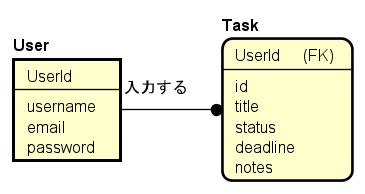

# job-schedule-app

## 目的

就活のタスクを管理し、進捗を可視化できる。

## 機能　(MVP段階)

1. ユーザ登録・ログイン
2. タスク登録 （タスク、ステータス、期限）
3. タスク一覧表示
4. タスク削除
5. ログアウト

## データ構造, ER図（MVP段階）



## 画面構成

- デフォルト画面
- 新規登録画面
- ユーザログイン画面
- タスク一覧画面
- タスク追加画面

## 使用技術

|カテゴリ|技術|
|----|----|
|フレームワーク|Django(Python)|
|データベース|SQlite3|
|フロントエンド|HTML / CSS / Bootstrap|
|認証| Django Auth|


## 拡張機能

- カレンダー表示
- 企業のグループ化
- ポップアップ通知機能
- Docker対応
- タスク完了チェックボックス
- 単体テスト / 統合テスト追加

## セットアップ方法

1. 仮想環境の作成と起動
```sh
python -m venv venv
source venv/bin/activate # (Windows: venv\Scripts\activate)
```

2. パッケージのインストール
```sh
pip install -r requirements.txt
```

3. データベースの作成
```sh
python manage.py migrate
```

4. 開発サーバー起動
```sh
python manage.py runserver
```

